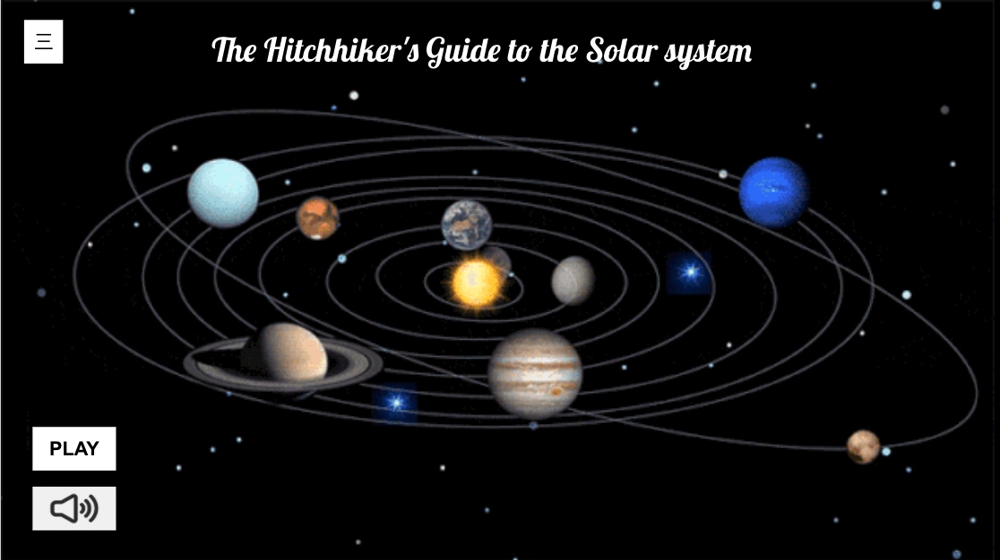

# The Hitchhiker's Guide to the Solar system

A project that simulates the movement of planets in the solar system.

## Team Members

Penghe Zhang - ly20254@bristol.ac.uk

Jing Yang - nd20739@bristol.ac.uk

Zhenni Qian - vb20656@bristol.ac.uk

Bingli Zhang - jp20819@bristol.ac.uk

Yi Yuan - of20438@bristol.ac.uk

# [Introduction](./doc/Introduction.md)

# [Background](./doc/Background1.md)

# [System Implementation](./doc/SystemImplementation.md)

# [UX Design](./doc/UXdesign.md)

# [Sprints & Project Management](./doc/Workingmethod.md)

# [Evaluation](./doc/Evaluation.md)

# [Conclusion](./doc/Conclusion.md)

##  Achievement

#### Web application

##### some prototype propictures

## Meeting Notes

#### 25/3/2021 

- Optimize the end back of our project, for example, storing the introdution of planet in database via mongo DB
- Take meeting notes twice a week and upload the records on github
- Next meeting(about our ideas and topic) with TA is 31/3/2021. The semi-finished project meeting is due on 18/4/2021

## Meeting Notes

#### 31/3/2021 

- identify target users, apply cartoonlizaiton for the front page if the website built for preschool education is decided
- inspiration for interaction part: users could comment and talk on the introduction page, find more existed web for reference
- Mongo database is optional

## Meeting Notes

#### 09/4/2021 

- Clarify and divide the parts of the project in more details, every member work on each module
- Update the function of end back: Quiz is achieveable, ten questions for every user
- The draft of the report is due on 17/4/2021