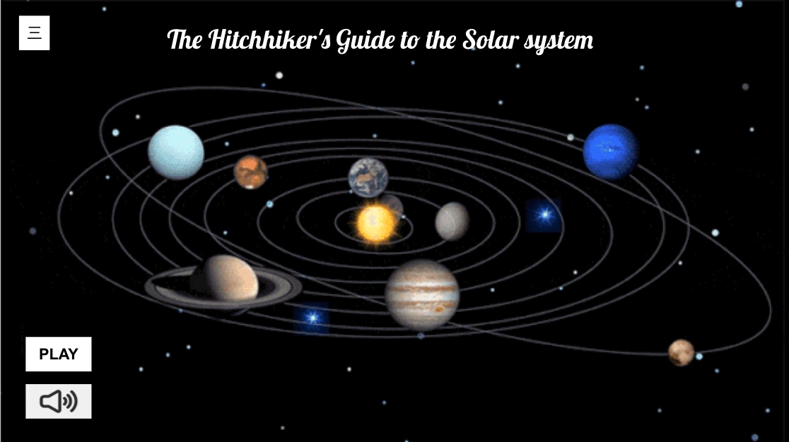
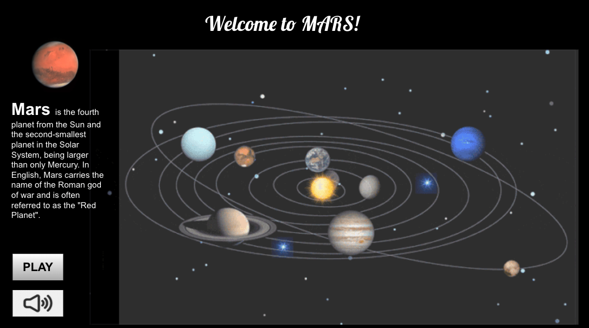

# The Hitchhiker's Guide to the Solar system

A project that simulates the movement of planets in the solar system.

This project was generated with [Angular CLI](https://github.com/angular/angular-cli) version 11.1.4.

##### some prototype propictures

## Meeting Notes

#### 25/3/2021 

- Optimize the end back of our project, for example, storing the introdution of planet in database via mongo DB
- Take meeting notes twice a week and upload the records on github
- Next meeting(about our ideas and topic) with TA is 31/3/2021. The semi-finished project meeting is due on 18/4/2021

## Meeting Notes

#### 31/3/2021 

- identify target users, apply cartoonlizaiton for the front page if the website built for preschool education is decided
- inspiration for interaction part: users could comment and talk on the introduction page, find more existed web for reference
- Mongo database is optional
