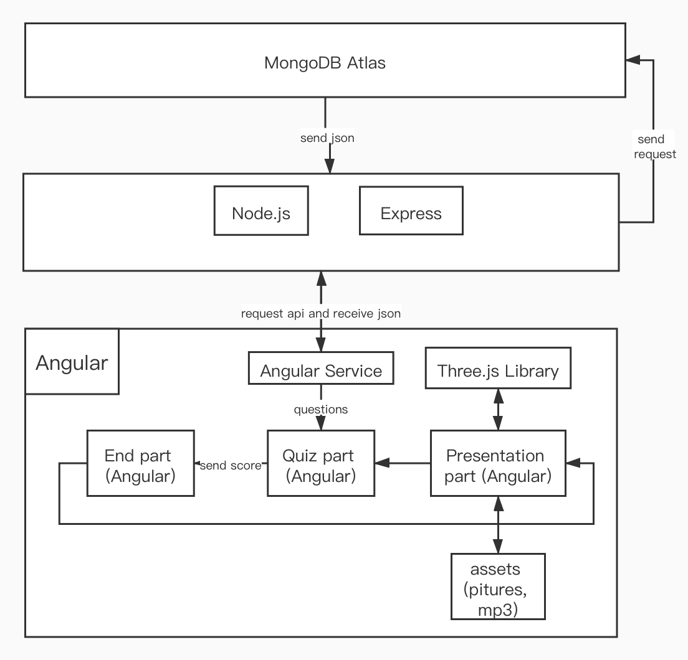
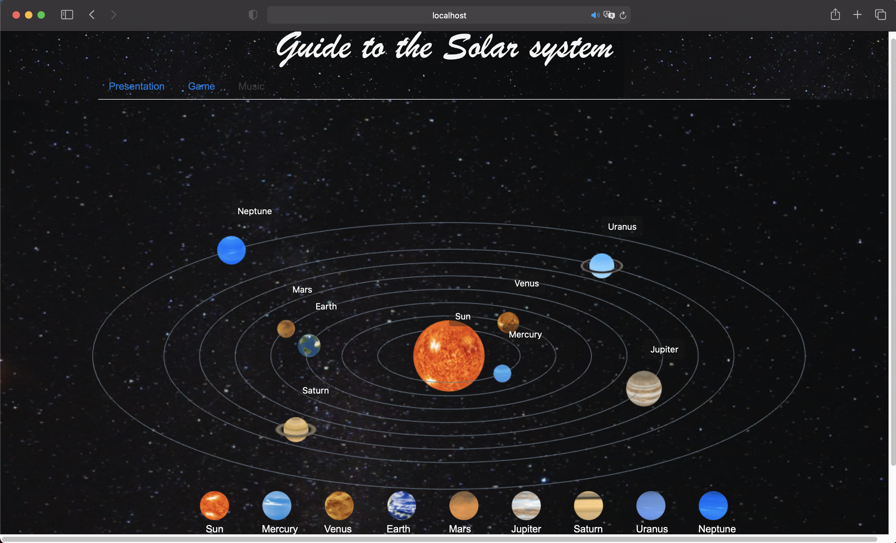

## System Implementation

### Stack architecture and system design

Backend : According to the characteristics of our website, we do not need to interact with the database too much, and for easier deployment, we use the Mongodb Atlas as the database.

Middle Tier : We use the minimal and flexible Express Node.js web application framework, and build APIs based on that.

Front End : Our project focuses on the front-end part. The front-end is composed of three parts, the display part (showing the solar system in a 3D scene dynamically), the quiz part (providing 10 multiple-choice questions and scoring), and the end part (providing a return after the quiz is finished)




### Front End - Angular Details of implementation


#### Comonents

##### Presentaion

The presentation part represents the planets' rotation and revolution in a 3D environment, user can hold down the mouse and move to get a 360-degree view of the solar system, and in the bottom of page, there are 9 buttons represents the planets whick can be clicked to make a short description of planets appear.

The overall layout of this part is shown in the figure below



We have implemented the following functions：

**Dynamic display of 3D model of solar system** 

In the presentation part, we mainly used the famous three. js library which is a cross-browser JavaScript library and application programming interface (API) used to create and display animated 3D computer graphics in a web browser using WebGL. The implementation of this part can be divided into the following parts:

1. Create the scene

   To actually be able to display anything with three.js, we need three things: scene, camera and renderer, so that we can render the scene with camera.

   First is the scene and the camera : 

   ```javascript
   var scene = new THREE.Scene();
   var width = window.innerWidth; // get window width and height
   var height = window.innerHeight; 
   var k = width / height; // set the ratio
   var s = 360;// up, down, left, and right range of camera rendering
   // create camera object
   var camera = new THREE.OrthographicCamera(-s * k, s * k, s, -s, 1, 2000);
   camera.position.set(700, 400, 700); // set camera position
   camera.lookAt(scene.position); // set camera direction
   ```

   Then create the renderer and insert to dom as an element.

   ```javascript
   var renderer = new THREE.WebGLRenderer({
     antialias: true
   });
   renderer.setSize(width, height);
   renderer.setClearColor(0x101010, 1); // set background
   document.body.appendChild(renderer.domElement); // insert to dom
   ```

2. Create planets object 

   In this part, we need to create mesh as planets and add them to scene, because wo have 10  planets to implement so we write a functin to simplify that:

   ```javascript
   function createSphereMesh(R, URL) { // planet radius and URL of its picture
     // create sphere geometry
   	var geometry = new THREE.SphereGeometry(R, 100, 100); 
     var texLoader = new THREE.TextureLoader();
     // use a picutre to create the material
     var material = new THREE.MeshBasicMaterial({  
       map: texLoader.load(URL),
       side: THREE.DoubleSide,// make we can see it from any perspective
       transparent:true,
     }); 
     return new THREE.Mesh(geometry, material); // create the planet object
   }
   
   ```

   there are some planets have ring around them, so we need to add Ring to them

   ```javascript
   function createRingMesh(r, R, URL) { // 2 radius of ring, URL of ring picture
     var geometry = new THREE.RingGeometry(r, R, 32);//create a ring geomerty
     return createMesh(geometry, URL);
   }
   
   function createringPlanetMesh(sphere_R, sphere_URL, ring_r, ring_R, ring_URL) {
     let group = new THREE.Group();  // use a group object to hold planet and its ring
     let spere = createSphereMesh(sphere_R, sphere_URL);
     let ring = createRingMesh(ring_r, ring_R, ring_URL);
     ring.rotateX(Math.PI/2);//adjust the gesture of ring
     group.add(spere, ring);
     return group;  // return the planet object
   }
   ```

   also, we implemented the planets' revolution trajectory in the scene,

   ```javascript
   function circle(r) {
     var arc = new THREE.ArcCurve(0, 0, r, 0, 2 * Math.PI, true); // origin, radius and start angle
     var points = arc.getPoints(100); // points array (the larger, the )
     var geometry = new THREE.BufferGeometry();
     geometry.setFromPoints(points);
     var material = new THREE.LineBasicMaterial({
       color: 0x708090  // set the color
     });
     var line = new THREE.LineLoop(geometry, material); // create line object
     line.rotateX(Math.PI / 2);
     return line;
   }
   ```

3. Mock the Planets data

   In the code, the radius, texture path, revolution radius and other parameters of all planets are all set in function data(), we use a reference value K to make relative size and trajectory of the planet.

   ```javascript
   function data() {
   // All parameters are not real data
   // Set a reference value K, the radius and revolution radius of all stars are 		  multiples of the changed parameters
     var K = 5;
     return {
       sun: {
         name: 'Sun',
         R: 10 * K, // 
         URL: 'assets/planets/sun.jpg', 
       },
       planet: [{
         name: 'Mercury',
         R: 2.5 * K,
         URL: 'assets/planets/Mercury.jpg',
         revolutionR: 20 * K,
       }, {
             name: 'Uranus',
             sphere: {
               R: 3.5 * K, // ridus
               URL: 'assets/planets/Uranus.jpg',
             },
             ring: {
               r: 4 * K, // inside radius
               R: 6 * K, // outside
               URL: 'assets/planets/UranusRing.png',
             },
             revolutionR: 80 * K,
           }, ......
    }
   ```

4. Create planet's tag

   In order to better identify the planet, we added  tags around the planets, display the name of the planet, and move with the planet, so we wrote createTag( ) and setTagPosition( ) to implement it.

   ```javascript
   // create the tag object
   function createTag(str) { //str : the planet's name
     var div = document.createElement('div');
     document.body.appendChild(div);
     div.style.position = 'absolute';
     div.style.display = 'block';
     div.innerText = str;
     div.style.padding = '6px 10px';  // set some parameters to the tag div
     div.style.color = '#fff';
     div.style.fontSize = '14px';
     div.style.backgroundColor = 'rgba(25,25,25,0.4)';
     div.style.borderRadius = '5px'
     return div;
   }
   
   // calcute the position of tags in canvas for render later
   function setTagPositionY(obj) { // obj : planet object
     var worldVector = new THREE.Vector3();
     // get world position in three
     obj.getWorldPosition(worldVector);
     var standardVector = worldVector.project(camera); //世界坐标转标准设备坐标
     var a = window.innerWidth / 2;
     var b = window.innerHeight / 2;
     var x = Math.round(standardVector.x * a + a); // translate to html position
     var y = Math.round(-standardVector.y * b + b)  + 40; 
     obj.tag.style.left = x  + 'px';
     obj.tag.style.top = y  + 'px';
   }
   ```

5. Render the planets, tags, 

   To render the solar system, we need calculate the object's position 

   ```javascript
   function render() {
     // rotation of sun
     sun.rotation.y += 0.01;
     setTagPositionY(sun);
     renderer.render(scene, camera);
     planetGroup.children.forEach(function(obj) {
       obj.rotation.y += 0.01;// rotation of planet
       // The larger the radius, the slower the rotation speed
       obj.angle += 0.001 / obj.revolutionR * 400;
       // Position setting during planet revolution
       obj.position.set(obj.revolutionR * Math.sin(obj.angle), 0, obj.revolutionR * Math.cos(obj.angle));
       setTagPositionY(obj);
     })
     requestAnimationFrame(render);
   }
   render();
   ```

After completing the above 5 steps, we can see the following effects


##### Quiz Game

The other part is  the quiz which give 10 questions to test the users knowledge about solar system and give a score after the quiz, then user can choose to play the quiz again or return presentation part.


##### End


### Back End


### Middle Tier


### 


### Deployment details