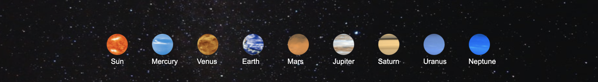
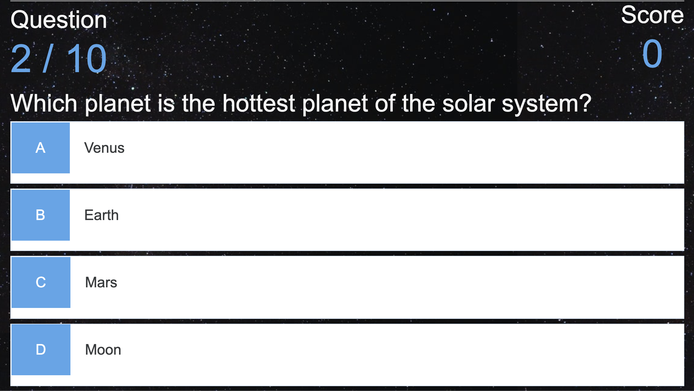
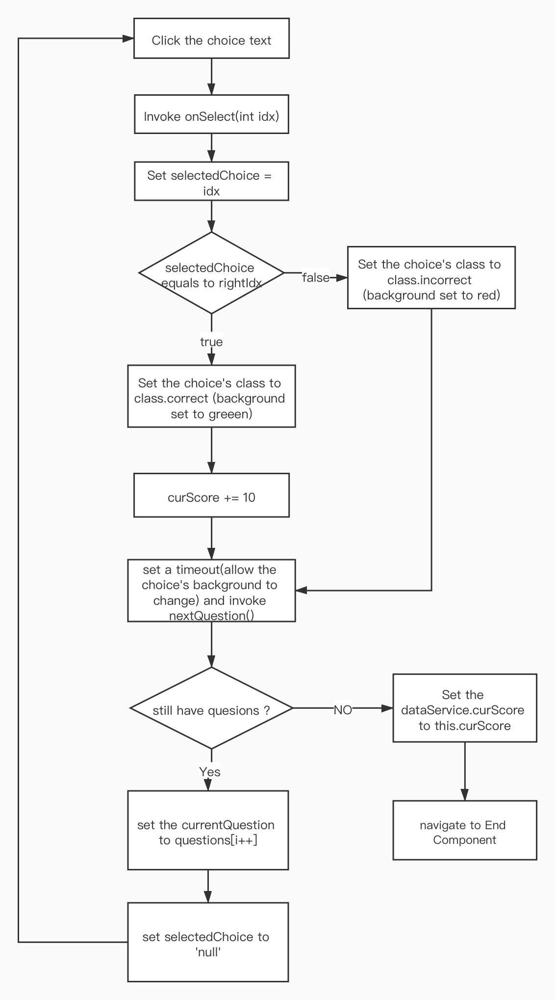
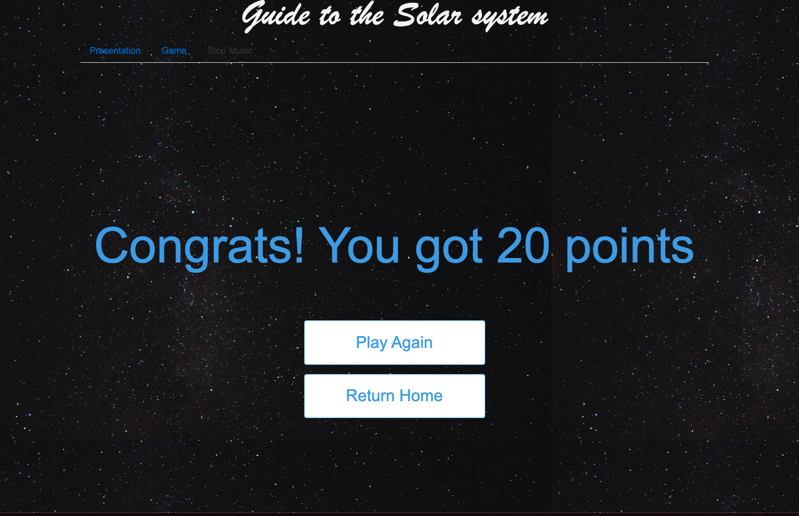

## System Implementation

### Stack architecture and system design

Backend : According to the characteristics of our website, we do not need to interact with the database too much, and for easier deployment, we use the Mongodb Atlas as the database.

Middle Tier : We use the minimal and flexible Express Node.js web application framework, and build APIs based on that.

Front End : Our project focuses on the front-end part. The front-end is composed of three parts, the display part (showing the solar system in a 3D scene dynamically), the quiz part (providing 10 multiple-choice questions and scoring), and the end part (providing a return after the quiz is finished)


### Front End - Angular Details of implementation

#### Comonents

##### Presentaion

The presentation part represents the planets' rotation and revolution in a 3D environment, user can hold down the mouse and move to get a 360-degree view of the solar system, and in the bottom of page, there are 9 buttons represents the planets whick can be clicked to make a short description of planets appear.

The overall layout of this part is shown in the figure below


We have implemented the following functions：

***Dynamic display of 3D model of solar system***

In the presentation part, we mainly used the famous three. js library which is a cross-browser JavaScript library and application programming interface (API) used to create and display animated 3D computer graphics in a web browser using WebGL. The implementation of this part can be divided into the following parts:

1. **Create the scene**

   To actually be able to display anything with three.js, we need three things: scene, camera and renderer, so that we can render the scene with camera.

   First is the scene and the camera : 

   ```javascript
   var scene = new THREE.Scene();
   var width = window.innerWidth; // get window width and height
   var height = window.innerHeight; 
   var k = width / height; // set the ratio
   var s = 360;// up, down, left, and right range of camera rendering
   // create camera object
   var camera = new THREE.OrthographicCamera(-s * k, s * k, s, -s, 1, 2000);
   camera.position.set(700, 400, 700); // set camera position
   camera.lookAt(scene.position); // set camera direction
   ```

   Then create the renderer and insert to dom as an element.

   ```javascript
   var renderer = new THREE.WebGLRenderer({
     antialias: true
   });
   renderer.setSize(width, height);
   renderer.setClearColor(0x101010, 1); // set background
   document.body.appendChild(renderer.domElement); // insert to dom
   ```

   

2. **Create planets object** 

   In this part, we need to create mesh as planets and add them to scene, because wo have 10  planets to implement so we write a functin to simplify that:

   ```javascript
   function createSphereMesh(R, URL) { // planet radius and URL of its picture
     // create sphere geometry
   	var geometry = new THREE.SphereGeometry(R, 100, 100); 
     var texLoader = new THREE.TextureLoader();
     // use a picutre to create the material
     var material = new THREE.MeshBasicMaterial({  
       map: texLoader.load(URL),
       side: THREE.DoubleSide,// make we can see it from any perspective
       transparent:true,
     }); 
     return new THREE.Mesh(geometry, material); // create the planet object
   }
   
   ```

   there are some planets have ring around them, so we need to add Ring to them

   ```javascript
   function createRingMesh(r, R, URL) { // 2 radius of ring, URL of ring picture
     var geometry = new THREE.RingGeometry(r, R, 32);//create a ring geomerty
     return createMesh(geometry, URL);
   }
   
   function createringPlanetMesh(sphere_R, sphere_URL, ring_r, ring_R, ring_URL) {
     let group = new THREE.Group();  // use a group object to hold planet and its ring
     let spere = createSphereMesh(sphere_R, sphere_URL);
     let ring = createRingMesh(ring_r, ring_R, ring_URL);
     ring.rotateX(Math.PI/2);//adjust the gesture of ring
     group.add(spere, ring);
     return group;  // return the planet object
   }
   ```

   also, we implemented the planets' revolution trajectory in the scene,

   ```javascript
   function circle(r) {
     var arc = new THREE.ArcCurve(0, 0, r, 0, 2 * Math.PI, true); // origin, radius and start angle
     var points = arc.getPoints(100); // points array (the larger, the )
     var geometry = new THREE.BufferGeometry();
     geometry.setFromPoints(points);
     var material = new THREE.LineBasicMaterial({
       color: 0x708090  // set the color
     });
     var line = new THREE.LineLoop(geometry, material); // create line object
     line.rotateX(Math.PI / 2);
     return line;
   }
   ```

   

3. **Mock the Planets data**

   In the code, the radius, texture path, revolution radius and other parameters of all planets are all set in function data(), we use a reference value K to make relative size and trajectory of the planet.

   ```javascript
   function data() {
   // All parameters are not real data
   // Set a reference value K, the radius and revolution radius of all stars are 		  multiples of the changed parameters
     var K = 5;
     return {
       sun: {
         name: 'Sun',
         R: 10 * K, // 
         URL: 'assets/planets/sun.jpg', 
       },
       planet: [{
         name: 'Mercury',
         R: 2.5 * K,
         URL: 'assets/planets/Mercury.jpg',
         revolutionR: 20 * K,
       }, {
             name: 'Uranus',
             sphere: {
               R: 3.5 * K, // ridus
               URL: 'assets/planets/Uranus.jpg',
             },
             ring: {
               r: 4 * K, // inside radius
               R: 6 * K, // outside
               URL: 'assets/planets/UranusRing.png',
             },
             revolutionR: 80 * K,
           }, ......
    }
   ```

   

4. **Create planet's tag**

   In order to better identify the planet, we added  tags around the planets, display the name of the planet, and move with the planet, so we wrote createTag( ) and setTagPosition( ) to implement it.

   ```javascript
   // create the tag object
   function createTag(str) { //str : the planet's name
     var div = document.createElement('div');
     document.body.appendChild(div);
     div.style.position = 'absolute';
     div.style.display = 'block';
     div.innerText = str;
     div.style.padding = '6px 10px';  // set some parameters to the tag div
     div.style.color = '#fff';
     div.style.fontSize = '14px';
     div.style.backgroundColor = 'rgba(25,25,25,0.4)';
     div.style.borderRadius = '5px'
     return div;
   }
   
   // calcute the position of tags in canvas for render later
   function setTagPositionY(obj) { // obj : planet object
     var worldVector = new THREE.Vector3();
     // get world position in three
     obj.getWorldPosition(worldVector);
     var standardVector = worldVector.project(camera); // get a vector to translate world position to html position
     var a = window.innerWidth / 2;
     var b = window.innerHeight / 2;
     var x = Math.round(standardVector.x * a + a); // translate to html position
     var y = Math.round(-standardVector.y * b + b)  + 40; 
     obj.tag.style.left = x  + 'px';
     obj.tag.style.top = y  + 'px';
   }
   ```

   

5. **Render the planets, tags and trajectory**

   To render the solar system, we need calculate the object's position 

   ```javascript
   function render() {
     // rotation of sun
     sun.rotation.y += 0.01;
     setTagPositionY(sun);
     renderer.render(scene, camera);
     planetGroup.children.forEach(function(obj) {
       obj.rotation.y += 0.01;// rotation of planet
       // The larger the radius, the slower the rotation speed
       obj.angle += 0.001 / obj.revolutionR * 400;
       // Position setting during planet revolution
       obj.position.set(obj.revolutionR * Math.sin(obj.angle), 0, obj.revolutionR * Math.cos(obj.angle));
       setTagPositionY(obj);
     })
     requestAnimationFrame(render);
   }
   render();
   ```

After completing the above 5 steps, we can see the following effects


***Background Music***

In order to enhance the richness of the display, we have added a background music part. After entering the presentation module, the background music automatically starts to play.

We added a music obj in PresentationComponent, and in its Constructor, we invoke load() and play() to make music play in the background.

```javascript
export class PresentationComponent {
  bgm = new Audio('assets/bgm.mp3');
  // ....
  constructor() {
    this.bgm.load();
    this.bgm.play();
    ...
  }
}
```


***Planet information display***

Another important part of the presentation part is the text introduction of the planet. By clicking on the planet’s button, the planet information can be displayed on the page. When clicking on other places, the display text disappears.

We set up 10 small pictures of planets in the html file, and bind the mouse click event in the ts file. Then create a picture element object in .ts file, If the click point is one of the planet buttons, set the src of the image element object to the text introduction picture of the planet, and display it on the screen.



```html

<span style="display:block; position:absolute; top:75px; left:310px; color:white;">
  Sun
</span>

<span style="display:block; position:absolute; top:75px; left:400px; color:white;">
  Mercury
</span>
```

```typescript
function choose(event) {
      img.src = '';
      var Sx = event.clientX;
      var Sy = event.clientY;
      if (Sy > 580 ){  // hard code to locate the planet button
        if(Sx > 320 && Sx < 370){
          img.src = 'assets/tags/Sun.png'
        }
        if(Sx > 420 && Sx < 470){
          img.src = 'assets/tags/Mercury.png'
        }
        // ...
 }
 addEventListener('click', choose);
```

Results as shown below：


##### Quiz Part

The other part is  the quiz which give 10 questions to test the users knowledge about solar system and give a score in the quiz, then navigate to end component.


***Basic layout***

Two parts are displayed at the top of the page, the current question index / total number of questions and the current score. Next is the question section, which first displays the question's description, followed by 4 options that use the same template.





We used the data-binding mechanism in angular framework,  we have bound attributes  ( questionIdx, curScore, curQuestion ), css style ( correct and incorrect ) and events ( onSelect( ), click ) in the HTML elements to monitor the choices made by the user and trigger the corresponding events (judge right or wrong, increase the score, load the next topic or lead to the end component).


```html
<h2 class="score">{{questionIdx+1}} / 10</h2>    
<h2 class="score" >{{curScore}}</h2>
<div class="question">{{curQuestion.question}}
  <div class="choice-container" [class.correct]=" selectedChoice === '1' && curQuestion.answer === '1' " [class.incorrect]="selectedChoice == '1' && selectedChoice !== curQuestion.answer" >
    <p class="choice-prefix">A</p>
    <p class="choice-text" (click)="onSelect('1')"> {{curQuestion.choice1}}</p>
  </div>
  ....
</div>
```


**The running process of componet**

The following is a flowchart of the interaction between html file and typescript file in Quiz component.

The first step is to get questions data, we write a service to get the questions array, but html will be displayed earlier than retrieveData(),  so we first used a mock questions whichcalled "loading", placed it on the page, pretending to be waiting for the data to arrive, after a short pause, call nextQuestion() to get the real problem. Then when user click the choice in page, the onSelect(int idx) will be called and send the user's choice to backend, the curScore may be added 10, after a short pause, the page will show next question. Most of the settimeout method is to give the HTML time to change the style and the content of question, so as to smooth the transition time of the page.





The following is the implementation process of the 3 methods


```javascript
retrieveData(): void {
  this.dataService.getAll().subscribe(
     data => {
      this.questionsFromServer = data;
    },
    error => {
      console.log(error);
    });
}
```


```javascript
// we need router to go to end component and dataService to set curScore and get data from server
constructor( private router: Router, private dataService: DataService ) {
  this.retrieveData();
  setTimeout(() => {
    this.nextQuestion();
  }, 800);
}
```


```javascript
nextQuestion(): void {
  // if there still some questions
  if (this.questionIdx === this.questionsFromServer?.length){
    setTimeout(() => {  // no more: set the curScore in dataService (the end component will use that) and navigate to end component
      this.dataService.curScore = this.curScore; 
      this.router.navigate(['/end']).then(r => {});
    }, 800);
  }else if (this.questionsFromServer != null){
    // set the curQuestion to the next question
    this.curQuestion = this.questionsFromServer[this.questionIdx++];
    this.haveChoose = '0';        // prepare for the next question
    this.selectedChoice = 'nul';  // prepare for the next question
  }
}
```


```javascript
// html will set the chiceNumber in the parameter
onSelect(choiceNumber: string): void {
  this.selectedChoice = choiceNumber;
  if (this.selectedChoice !== this.curQuestion.answer){
    // if the answer is wrong, do nothing
  }else{
    console.log('right answer');
    this.curScore += 10;
  }
  setTimeout(() => {
    this.nextQuestion();
  }, 800);
}
```


The simplified diagram of the internal call relationship is as follows：


贴一个 gif 图 ，问题切换的


##### End

This part has two functions. First, it displays congratulations and the score of quiz. Second, it provides two buttons to return to the other two parts.

We bind the curScore attribute in the html, and bind the routerLink to  other part in the buttons, so user can click the button to the presentation componet or quiz part.

```html
<div class="container">
  <div id="home" class="flex-center flex-column">
    <h1 >Congrats! You got {{curScore}} points </h1>
    <a class="btn" routerLink="/game">Play Again</a>
    <a class="btn" routerLink="/presentation">Return Home</a>
  </div>
</div>
```


In order to pass the score from the quiz part to the end part, we declare curScore variable in the dataService and import it to both components, whem the game part is done, it will set the game component's curScore to dataServer.curScore, so end Componet can get the user's score by call dataService.getScore() and HTML will show.

```javascript
constructor( private dataService: DataService) {
  this.curScore = dataService.getScore();
}
```





##### Other **part**

**Hover effect**

When the mouse is hovering over the choice, we added a hover feature, the entire div emits blue light and moves up a short distance.

```css
.choice-container:hover {
  cursor: pointer;
  box-shadow: 0 0.4rem 1.4rem 0 rgba(86, 185, 235, 0.5);
  transform: translateY(-0.1rem);
  transition: transform 150ms;
}
```

// hover gif


**DataService**

The dataService is used to get question object from server and act as an intermediary to pass score variables. 

In the definition of the data object, for simplicity of implementation, we set all attributes to string and include the correct answer inside each qeustion object.

```typescript
export interface Question {
  question: string;   // the descrption of quesion
  choice1: string;    // four choice
  choice2: string;
  choice3: string;
  choice4: string;
  answer: string;    // the right answer value in ('1','2'.'3','4')
}
```

geAll() method will use Httpclient to get json from specific address and we specify this Question[] to map json object to quesiont array.

```javascript
public curScore = 0;   // can be accessed from end and game component
private REST_API_SERVER = 'http://localhost:3000/api/game';
constructor(private httpClient: HttpClient) { }

// get json and cast to Question[]
public getAll(): Observable<Question[]>{
  return this.httpClient.get<Question[]>(this.REST_API_SERVER);
}
```


### Back End


### Middle Tier


### 


### Deployment details
