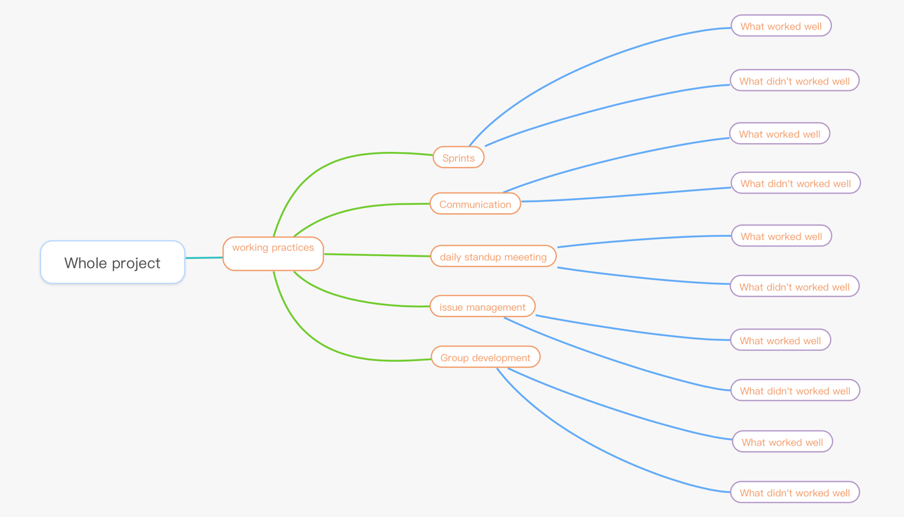

# **Reflection on working practices**

As the flow chart shown below, we subdivided the whole working practices into five different task groups, and we will discuss them respectively.

## **Our working practices**

In the part of Sprints, we use the software - Zoho for Agile project management. Penghe is token as the scrum leader to promote project progress while Zhenni focuses on collecting and analyzing user data because of her excellent PR ability. Given Bingli is good at arrange program, she is mainly responsible for managing and maintaining Zoho accounts. And Jing and Yi are interested in technical development, so they are the in the team.

In the communication, we use several different communicate channels to keep a close connection, for example, we use Wechat, Teams and offline meeting at the same time.

In the daily standup meeting, we host this part in WeChat group at 12.00pm every day. During the meeting, everyone would share what they did today, what will they do tomorrow and what problem they face now. And our leader Penghe would organize us to solve the issues we faced.

With regard to issue management, what we mentioned before, we discuss and ask a question in the daily standup meeting, and our project leader would determine whether we need a new meeting to solve it and how to solve it.

As for group development, we use Zoho and Github to arrange all the materials we need. Our development goal is to meet customer needs, so our development direction is based on user feedback. Besides, we subdivided our goal into 2 parts, now and future, to support us do better.

## **Evaluation of working practice**

We have the prefect project division as each member could play to their best advantage. During the project development cycle, we have a close cooperation, so our project can run smoothly. However, the schedule at the beginning of the project is not reasonable, for example, our questionnaire is not timely so that we spent loads of time to modify the content of project. But luckily, we found out it in time and made changes to avoid lacking time in the later period.

In terms of communication, we chose the most suitable communication method according to your actual situation. Take WeChat as an example, which is a very popular social media in China. As a Chinese, we login to WeChat nearly every half an hour on average. So chosen it as our main communicate channel could ensure we receive new messages in the shortest time. Moreover, we would host a offline revise meeting when we decide to compete a sprint and start a new one. For us, face-to-face meeting is exactly suitable for making an important decision. But we are also struggling with the jet lag as our team not in one time zone.

As for our daily meeting, we all think it’s a brilliant idea for us complete our project step by step and problem also would be solved in time, but we also need to recognize that we fell into a lazy situation in the later stage because we don’t have relative punishment. 

Then, in the part of issue management, we would feedback problem to our leader for decision-making, so almost of all issues had been effectively and quickly resolved. 

Finally, when it comes to the Group development, we are happy that our group has a clear division, so every member will not too free or too busy. Besides, through daily meeting, we also can discuss our situation and get help from others. More importantly, even if the coursework is finished, we find a big interested in this project and we will continue to develop it in the future. During the whole development period, we could recognize we need spend more time and labor in technical support and technical development.  

# Reflective discussion of the success of the project
Overall, our team was quite successful in delivering the working prototypes in the initial conceptual design. We are full of confidence in the results of our work over the past few months.

At the beginning of the conception process, the interactive interface we designed was simple and elegant, with clear navigation. It is clearly divided into two display and game modules, so that the development of the two parts can be carried out relatively independently and simultaneously. Thanks to the down-to-earth investigation and design in the initial stage, we did not experience major functional changes and wasted time in the later development process. In the end, we fully realized the expected functions of the two parts in [UX design](https://github.com/uobginnyqian/Group28/blob/main/doc/UXdesign.md).

The front end is the top priority of our web pages. The display part, showing the solar system in a 3D scene dynamically, is the achievement we are most proud of. We used the Three.js library to implement this part. As a native web3D engine, Three.js has the advantage of plug-in web3D engine: it does not need to install plug-ins and is well supported on the mobile side. In addition, compared with other web3D engines, it also has the characteristics of rich cases, flexible design, and convenient expansion. Three.js perfectly satisfies our design requirements for the built-in conversion perspective, changing the size, and clicking the pop-up text introduction floating window on the web page. However, its huge library is more than enough for the functions we want to achieve, and the learning cost is high.

Since our project does not require a user to register an account, the backend content of the project is less. We do not need to interact with the database too much, and for easier deployment, we use the MongoDB Atlas as the database. This is a very suitable choice for our system implementation. Of course, the performance of MongoDB is quite flexible, and we want to add a new registration module in the future, and it can also be competent.

Finally, we are very proud to be able to complete the goal of allowing children to understand and meet the concept interpretation of the solar system with simple and clear language and three-dimensional display, listening to the educational needs of the target user group and cooperating with the team to overcome difficulties, so that we feel ourselves The work is valuable.

## Future work on evaluation
As the content of the project increases, we should consider using professional testing software instead of manual testing to test web pages.

Develop more detailed test plans and rating standards for user acceptance testing, such as questionnaires to evaluate stars.

# Social and Ethical implications 

Our project can be used for astronomy education for young students in society, providing them with a dynamic, interactive, and consolidating way to understand the knowledge of the solar system.

However, in our solar system simulation, the speed, size, and position of the planets are not very rigorous; it may mislead people who lack of common sense and trust the website. If these people spread the wrong knowledge, It will have a bad influence on the astronomy education of the whole society.

Secondly, the harm of electronic equipment to young people cannot be ignored. If young people are addicted to our website, they will have problems such as health hazards, decreased ability to communicate with others, and minor mental illnesses. Therefore, this type of education may not be suitable for mainstream use in  astronomy educational.

For the education of hearing impaired and visually impaired children, our website does not make any adaptation. Unfortunately, our project is completely useless for them.

## Future work on system implementation

In terms of system implementation, there are many things that can be done in the future,

In terms of quiz, 

-  We only have 10 question banks that are not enough to meet the needs, and need to be expanded, and answer analysis can also be added; 
- For better review, we can add a user-specific answer record module to record all wrong answers; 
- In order to allow users to keep learning, we can add a punch-in module to record the number of days of continuous questioning and increase user stickiness;

In the display of the solar system, 

- We can add more background music with cosmic characteristics for users to switch and increase the freshness; 
- We need to be more precise about the size, relative position, and speed of the planet, as close to science as possible, and write "This is an unrigorous model" on the page;
- The current introduction of the planet is still too simple, we can add the next page function or display more detailed information;
-  In the education of visually impaired children, we can add the voice broadcast function to read the current mouse in real time The content under the location, and the operations that can be performed.
- In the layout of the planet picture at the bottom of the page, the hard code needs to be transformed into an automatically adapted layout.

# **Reflection on effection of COVID**

First of all, we do have to admit that the coronavirus had a significant impact on the development of our project, and that the negative impact outweighs the positive impact.

Due to the social distance regulation early this semester, the discussion room in campus was not available and therefore we did not have the opportunity to discuss offline. In addition, one of our team members is still in her own country for remote learning. In this case, we only have weekly online discussions via Teams.

For the design research phase, we were originally designed to be able to communicate with interviewees face to face. However, at the same time, due to regulations, it is difficult for us to conduct offline interviews, and we could only communicate through online social application. Obviously, there are some drawbacks in online communication. For example, it is hard for us to make student interviewers focus on our questions, which leads to a short time of effective interview.

The same problem also occurs in the questionnaire phase. Although the number of online questionnaires will be more, we could hardly control the target surveyors for obtaining our data of questionnaires. It will be more direct and efficient by collecting questionnaire offline.

In terms of positive effection, we have agreed on a working model. After assigning tasks, we will complete our own parts, update our progress every day, and hold at least one plenary meeting every week. This allows us to focus more on our own part and helps us to complete our work efficiently.

# **Future work**

Regarding the future work of design, the functionality of the web page needs to be expanded. At this stage, we can only achieve two functions: planetary information display and testing. In the future improvement, we can increase the social section to improve the interactivity of the website. For example, users can post a bubble with their own opinions in the planetary simulation map, and they can also comment on the opinions of others. For the answer section, in order to increase the fun, we can set up a theme answering contest every week. In addition, setting up a leaderboard is also a good choice, users can try multiple times to get high scores and good rankings.
