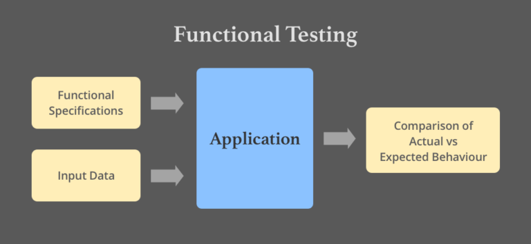
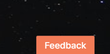
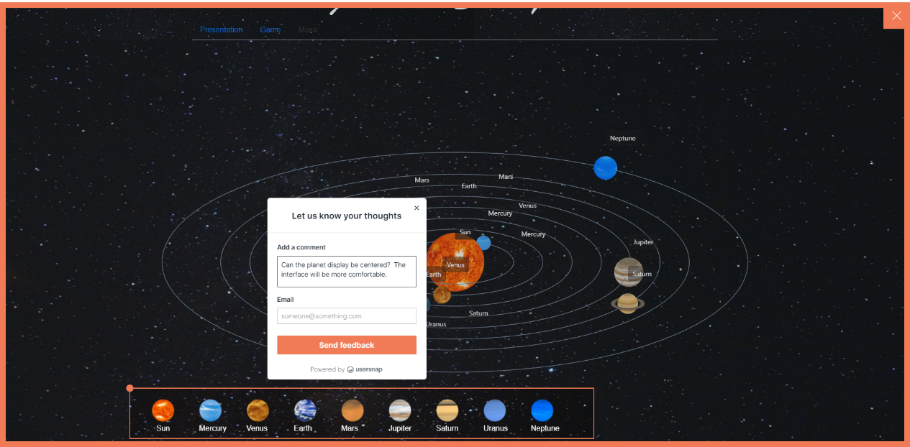
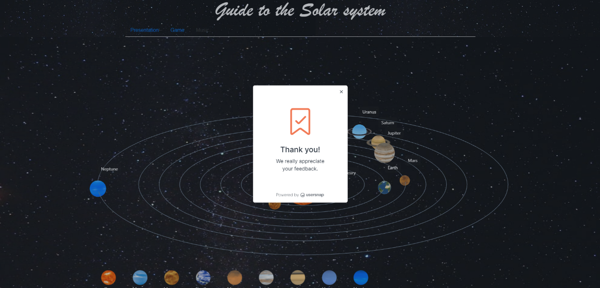
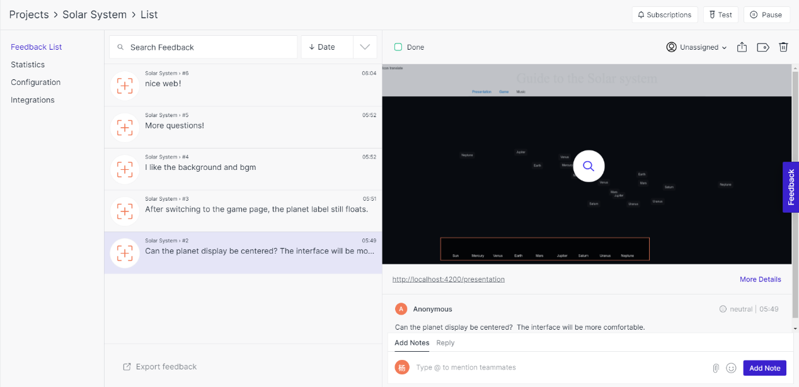

# Evaluation

Our evaluation of the project mainly starts from two aspects: functional testing and user acceptance testing.

We use manual testing for functional testing, which is divided into four parts: navigation, display, game, and browser compatibility.  

User acceptance testing is conducted using Usersnap, which is convenient for collecting and responding to user feedback.


## Functional testing

Web Functional testing is a process to test Web applications to detect if your web application is functionally correct. Web Functional testing involves carrying set of tasks and comparing the result of same with the expected output and ability to repeat same set of tasks multiple times with different data input and same level of accuracy. Implementing functional testing for an application in the software development cycle speeds up development, improves quality and reduces risks towards the end of the cycle. 





### **Test Plan**

After the previous part of the system design and implementation, we conducted a detailed functional test on the web to ensure that each part of the program did the expected function, and as far as possible to find hidden problems. The following is what we tested:

#### **a. Navigation**

Check whether clicking the "Presentation" and "Game" buttons can correctly jump to the two components;

Check whether the user can stop playing background music by clicking "music".

#### **b. Presentation Component**

Check whether the model, animation, trajectory, font, color, background, button, and label of the solar system presentation part are displayed completely and whether the position is correct;

Check whether the model can be dragged correctly with the left mouse button;

Check if clicking the planet at the bottom of the screen can correctly pop up the text introduction.

#### **c. Game Component**

Check whether the content of the question and the graphics of the tab are displayed correctly;

Check whether the card has the correct color change after the mouse clicks on the option;

Check whether to jump to the next question after clicking the option;

Check whether the test scores are counted correctly;

Check whether the question number is counted correctly;

Check whether the end page of the answer is displayed correctly.

#### **d. Browser compatibility test**

Check whether the webpage can be opened in IE, Google Chrome, Firefox, Opera.


### **Test Results**

The expected web functions are complete, and the interface layout and attribute controls are qualified.

We tried our best to cover all aspects when doing functional testing, but the implementation process was slightly cumbersome. Web Functional Testing can be performed both manually with a human tester or could be performed automatically with use of a software program. As the content of the project increases, we should consider using professional testing software instead of manual testing to test web pages.


## User acceptance testing

We conducted user acceptance testing (UAT) in the last phase of the web testing process. During UAT, actual users test the software to make sure it can handle required tasks in real-world scenarios, according to specifications. 

UAT is one of the final and critical software project procedures that must occur before newly developed software is rolled out to the market. We attach great importance to the work at this stage. We conducted preliminary tests in the target user group and obtained rich feedback. 


### **Test Plan**

We used Usersnap to collect feedback.  This is a product that can be easily added to the Web, allowing screenshots and collecting user comments, tracking bugs reports on any website, prototype, or application. Then it sends feedback and report bugs with screenshots and annotations directly in the browser. 

We add the Usersnap widget on the page with the following code to provide users with channels for giving feedback:

```javascript
<script>
  window.onUsersnapCXLoad = function(api) {
    api.init();
  }
  var script = document.createElement('script');
  script.async = 1;
  script.src = 'https://widget.usersnap.com/load/0566da2e-f590-482f-aef5-127a5e0a2e30?onload=onUsersnapCXLoad';
  document.getElementsByTagName('head')[0].appendChild(script);
</script>

```


The Widget is displayed as follows:





When the user clicks the "Feedback" button, an interface for screenshots and text feedback will be displayed:





Finally, there will be a pop-up window to thank users for their valuable feedback:





### **Test Results**

Users generally like our art design, which gives us great encouragement.  Some users expressed their enthusiasm for the small question-and-answer session and thought it was very fulfilling.

The planetary button is not displayed in the expected position on some users' computers,.

Some users think that we can add more contents about planetary knowledge and enrich the question bank.

Part of the feedback we got:



Although the development cycle is coming to an end and time is tight, we will put the functions required by users in the focus of future work.
