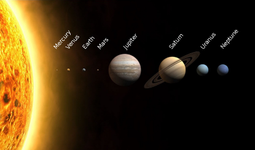
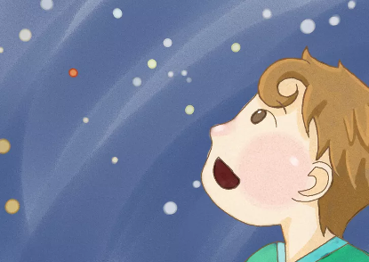

# Introduction

## Abstract

We refer to the "solar system" as it has been named after our sun, called "sol" which is Latin for "sun." The words "Solar System" related to two things: Any celestial body that is "of the Sun," and a collection of objects that work together to form the entire whole.

As humans, we have been viewing, watching, and studying our solar system over the millennia. Astronomy is the oldest of the physical sciences. The night sky and its array of stars, wandering planets, changing moon phases, occasional comets and meteor showers, and, in far northern and southern latitudes, shimmering auroras, have fascinated mankind and stimulated the imagination of generations. With the recent discoveries of planets orbiting other stars and the exotic environments of the planets and moons in our solar system, the opportunity is there to fascinate a new generation with the wonders of the universe. Teaching children astronomy can appear challenging to the point of intimidation, but it is significate to stimulate children’s interest in astronomy. We love to learn about the Solar system and hope children do too! Our project is to provide parents and teachers with some ideas and methods for teaching astronomy to children and to protect children's curiosity vividly and understandably.

 

Our project is for kids from K2 to 12, and will help with homework, or teach budding astronauts to understand what it takes to make it to the Solar system! Through a three-dimensional display and detailed and child-understandable introductions, it is no harder for children to touch the distant solar system.

 

The project is designed to let users tour the solar system by browsing the solar system. Users can tour other solar systems and return to their own by selecting our sun (Select Sol), read summaries of solar system objects and then display them. Moreover, it contains a complete system from learning to revising and from learning to applying.

## Objectives

The core objectives of our project are:

To provide knowledge that explains astronomy in language children can understand and content on solar system explaining concepts in simple, clear, real-world language, with examples that your child can relate to, and three-dimensional displays. 

To encourage children to explore and experiment. Science, not just astronomy, is based on coming up with ideas and testing them out to see if they work. Much of the way children play is devoted to exploring and understanding the world around them. Allowing him or her to play with the online stage is a good way to stimulate creativity and to develop a desire to learn. 

 

To narrow the economic gap and to reduce the cost of study, any child can reach this website on a single flat computer via the Internet. We designed this project and harnessed the power of technology to bridge the divide and ensure no child is left.