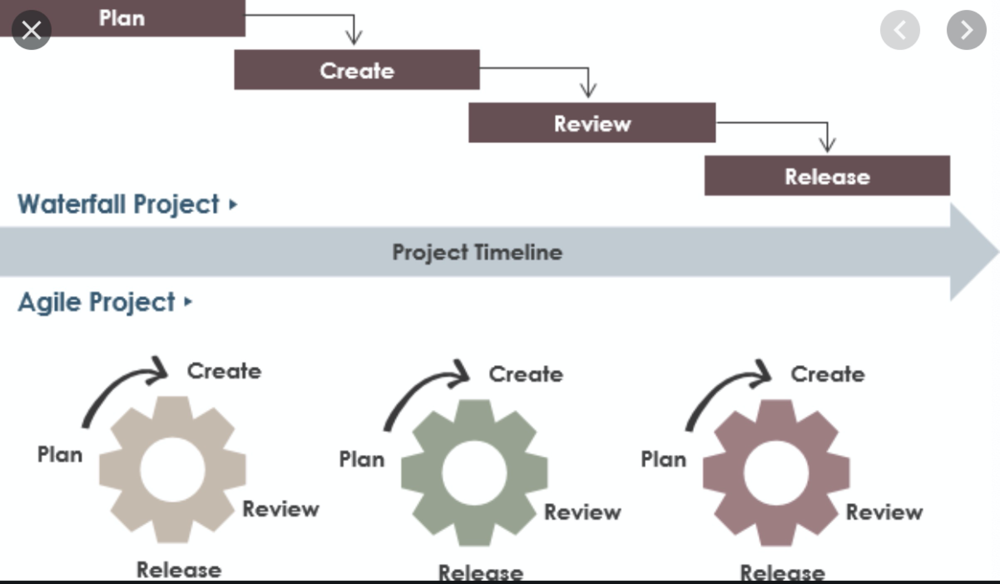
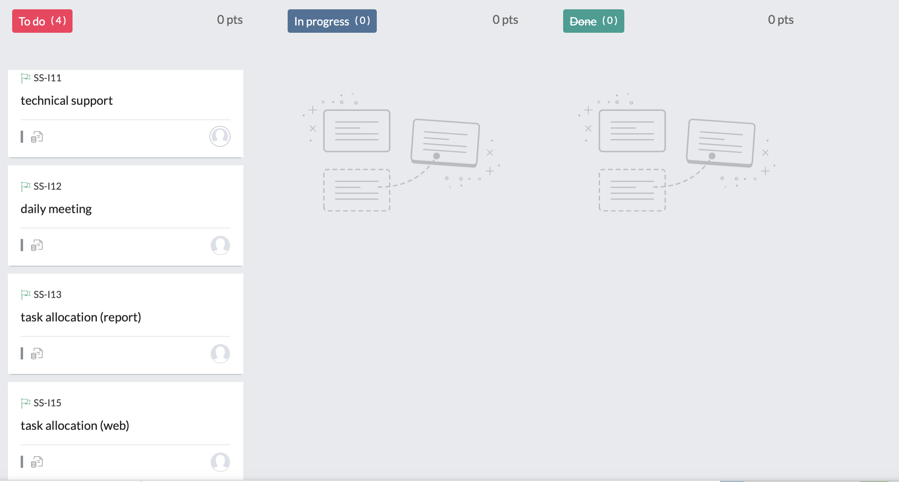
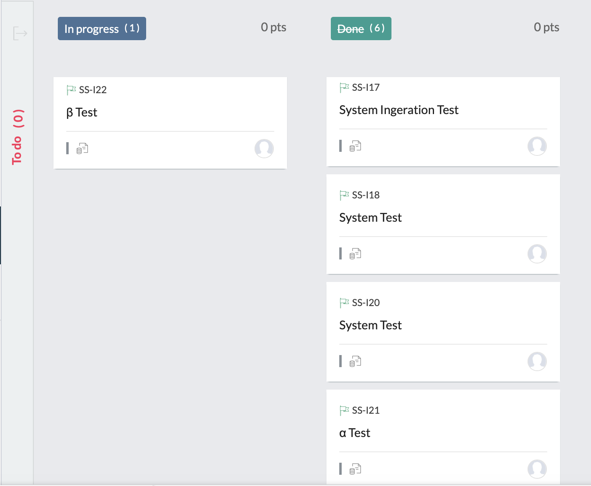
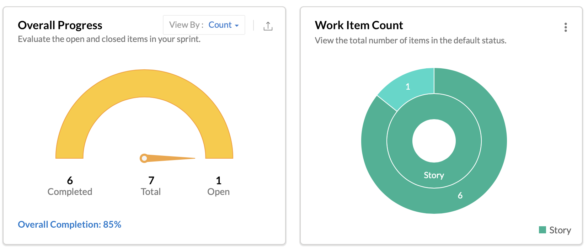

- [**Working method**](#working-method)
- [**Communication method**](#communication-method)
- [**Sprint timeline**](#sprint-timeline)
- [**Team's Workflow**](--team-s-workflow---)

# **Working method**

Given the importance of having a reliable project management methodology during the software developing period, we started the project with a sprint planning meeting. In this meeting, we discussed several mainstream methodologies together and after analyzing their pros and cons carefully, we decided to narrow the selection to waterfall model and agile model. More details will be listed respectively below.

## **Waterfall model:**

First, we’ll talk about waterfall method. In software development, waterfall model tends to be among the less iterative and flexible approaches, as progress flows in largely one direction ("downwards" like a waterfall) through the phases of conception, initiation, analysis, design, construction, testing, deployment and maintenance. The model is depicted below:

The sequential phases in Waterfall model are:

1. Requirement Gathering and analysis: all possible requirements of the system to be developed are captured in this phase and documented in a requirement specification document.
1. System Design: The requirement specifications from first phase are studied in this phase and the system design is prepared. This system design helps in specifying hardware and system requirements and helps in defining the overall system architecture.
1. Implementation: With inputs from the system design, the system is first developed in small programs called units, which are integrated in the next phase. Each unit is developed and tested for its functionality, which is referred to as Unit Testing.
1. Integration and Testing: All the units developed in the implementation phase are integrated into a system after testing of each unit. Post integration the entire system is tested for any faults and failures.
1. Deployment of system: Once the functional and non-functional testing is done; the product is deployed in the customer environment or released into the market.
1. Maintenance: There are some issues which come up in the client environment. To fix those issues, patches are released. Also to enhance the product some better versions are released. Maintenance is done to deliver these changes in the customer environment.

It’s easy to find that the waterfall model maintains that one should move to a phase only when its preceding phase is reviewed and verified, in other word, each phase of development proceeds in struct order and do not overlap.

The Pros:

- Simple and easy to understand and arrange tasks.
- Phases are processed and completed one at a time.
- Works well for smaller projects where requirements are very well. understood.
- It allows for departmentalization and control.

The Cons:

- No working software is produced until late during the life cycle.
- Cannot accommodate changing requirements or go back to revise or change
- High amounts of risk and uncertainty.

## **Agile model**

Then, let’s talk about Agile methodology. Agile model is a combination of iterative and incremental process models with focus on process adaptability and customer satisfaction by rapid delivery of working software product. Agile Methods break the product into small incremental builds. These builds are provided in iterations. Each iteration typically lasts from about one to three weeks. The model is depicted below: 

The Agile Manifesto principles are:

1. Individuals and interactions: In Agile development, self-organization and motivation are important, as are interactions like co-location and pair programming.
1. Working software: Demo working software is considered the best means of communication with the customers to understand their requirements, instead of just depending on documentation.
1. Customer collaboration: As the requirements cannot be gathered completely in the beginning of the project due to various factors, continuous customer interaction is very important to get proper product requirements.
1. Responding to change: Agile Development is focused on quick responses to change and continuous development.

It’s easy to see that Agile methods are being widely accepted in the software world recently.

The Pros:

- Resource requirements are minimum.
- Suitable for fixed or changing requirements.
- Minimal rules, documentation easily employed.

The Cons:

- Not suitable for handling complex dependencies.
- Depends heavily on customer interaction, so if customer is not clear, team can be driven in the wrong direction.
- There is a very high individual dependency
- Transfer of technology to new team members may be quite challenging due to lack of documentation.

## **Agile model vs Waterfall model in our project**

The following is a comparison chart of the two models:

 

After carefully comparing the two models, we decided to use Agile method. There are two main reasons for that:

With regard to the analyze before, we can see Agile is based on the **adaptive software development methods**, whereas the waterfall model is based on a predictive approach, which means it entirely depend on the r**equirement analysis and planning**. Given the situation that we are unable to predict all possible things in the beginning of the cycle, we cannot complete all the required documents. What’s more, as our software is Customer-Oriented, we were unable to clarify our user needs when we haven’t got all valid results of questionnaire in the planning phase, which result in missing and incompletion of user requirements document. So in order to promote the progress of project, it’s better for us to use Agile model.

Besides, given that we have to work remotely due to the lockdown, we are concerned about the independence of each task. So in this special situation, the high request of independence of agile projects has become its important advantages. 

### **Scrum - Zoho Sprint Project:**

In order to better use Agile project management, we use the software - Zoho to arrange whole project. All relative backlog tasks and sprints were added to Zoho, so every member could access it and see what was : to be done, in progress and done.

In Zoho, we focus on product backlog, sprint backlog and burn down chart, which can help us run the program better.

# **Communication method**

In light of this special period, one of our team member cannot arrive at Bristol in this term. So in order to ensure the smooth progress of the project and improve the efficiency of communication, we decided to combine the online communication method and face-to-face meeting. Given our team members are all from China, we chose to use WeChat, a famous social media in China, as our main daily-communication platform during the developing period. Besides, we chose to host weekly group meetings via the Microsoft Teams as we could record and playback meetings easily.

In the WeChat app, we created a new group named Software Group. In the group, we host Daily Standup Meeting (3 questions we should report every day at 12.00: what we have done today, what we will do tomorrow and what problem we face now) and notify each meeting time of Sprint Planning Meeting, Review Meeting and Retrospective Meeting. 

In the Teams app, we host weekly meeting to discuss our project and revise our user requirement.

With the help of these two apps, we were able to work collaboratively whilst living in different location. Besides, in Deans Court common room, we host an offline meeting every month to have a chance to communicate face-to-face and check our code. We believe it’s a best way to discuss and plan the next new sprints.

### **Team Organisztion & Individual contributions**

In light of the roles of Scrum, We assigned team member roles through a face-to-face meeting. In what follows, we give a quick breakdown of the individual roles of each team member in scrum framework.

### **Scrum Framework**

1. Project Owner: They are responsible for adding tasks or modifying requirements to the team and responsible for maintaining product orders, representing the interests of stakeholders. Given that Qian Zhenni and Zhang Bingli’s undergraduate major is marketing and economics, they are sensitive to user needs, so we believe Qian and Zhang are suitable for the position of product manager. Their outstanding market research ability and project management ability can help us run project smoothly.
1. Scrum Master: is the project leader, what he needs to do is to protect the team, taking into account the needs of the product manager, and ensure the project can be delivered on time. So Scrum Master should have a strong technological background to support the whole project. Given that Zhang Penghe is prefect in coding and has a clear idea about whole program, he is the best candidate for this position. His unbeatable technological skills and self-study ability can lead our team well.
1. Team: a cross-functional team of people who responsible for self-management and software development. They are mainly developers and test designers. Given that Yang Jing and Yuan Yi are interested in these field and desired to have a deeper understanding about front-end, they are focus on assisting Penghe in software development and maintenance.

### **Individual contributions**

Besides, we subdivided the whole project again according to the specific task.

Zhang Penghe (coder/leader): he took on the leadership role of whole project, and    provided technical supports. He mainly focus on front-end: Planet Show and Back-end: data stored in MangoDB. Besides, Penghe also responsible of updating Github once a week.

Yang Jing (coder/front-end)：she is focus on determining background and motivation and help Penghe finish the web design.

Qian Zhenni (product manager/back-end)：she is mainly focus on UX Design and early-stage project management.

Yuan Yi (technical supporter/back-end)：she took part in building front-end of the project, and find the relative technological supports and tutorials for us to use.

Zhang Bingli (product manager/back-end)：she is responsible of updating backlog and sprints in Zoho once a month, determines what needs to do in the next sprints and what tasks need to be closed.

# **Documentation of Sprints** 

## **Sprint timeline**

### **Sprint 1: project preparation phase**

- Timeline: 2021/2/5 - 2021/2/28
- Goal: determine how to start the project and outlook the whole project.
- User stories completed:
  - Confirm the topic of project
  - Confirm how to display the content of web
  - Task allocation
  - Reflect and revise
- Notes: The phase is important during the developed period, and the requirement may be changed 
- 

**Summary of plan for sprint 1**

As the graph shows, we divided the sprint into 4 different tasks: 

- Confirm the topic of project.
- Confirm how to display the content of web.
- Task allocation.
- Reflect and revise.

Whenever a task ends, we will conduct a reflection and review meeting to discuss whether the topic is feasible and meaningful or not, if we find our plannings cannot meet user’s needs, we would modify them.

**What was accomplished in sprint 1** 

We updated our progress of tasks completion into Zoho, so that we could revise our program every time. During the sprint 1, we 

Conducted a questionnaire survey on our recipient students, and after analyzing the questionnaire results, we transferred our initial planning: making a puzzle game into designing Q&A session to help children learn more on the web.

**Meeting time in sprint 1**

We took part in 6 brainstorming meetings to complete Sprint 1. The  meeting records are below:

Meeting1:

meeting date: 2021/2/9 

meeting location: Teams Desk 28

meeting time: 13.45 - 14.15

duration: 30min

meeting goal: preliminary discussion of the project

Meeting2:

meeting date: 2021/2/11

meeting location: Teams Desk 28

meeting time: 10.20 - 11.20

duration: 60min

meeting goal: share our ideas about interesting web and content

Meeting3:

meeting date: 2021/2/16

meeting location: Teams Desk 28

meeting time: 10.20 - 11.20

duration: 60min

meeting goal: narrowing our options in less than three topic

Meeting4:

meeting date: 2021/2/18

meeting location: Teams Desk 28

meeting time: 10.20 - 11.20

duration: 60min

meeting goal: discuss the feasibility of the candidate topic and plan the content

Meeting5:

meeting date: 2021/2/21

meeting location: WeChat Video Call | face to face in DC common room

meeting time: 14.00 - 15.00

duration: 60min

meeting goal: analyze the results of questionnaire and discuss how to improve our content.

Meeting6:

meeting date: 2021/2/28

meeting location: WeChat Video Call

meeting time: 14.00 - 15.00

duration: 60min

meeting goal: final determination our project topic.

### **Sprint 2: project implementation phase**

- Timeline: 2021/3/1 - 2021/4/15

- Goal: Project construction and report writing

- User stories completed:
  - Technical support
  - Daily meeting
  - Task allocation (web)
  - Task allocation (report)
  
- Notes: We need to think and discuss the program from the perspective of users. As a user, I want to learn knowledge from the web; As a user, I want the web is clear to read; As a user, I want to know the outline of the project through the report…

  

**Summary of plan for sprint 2**

**What was accomplished in sprint 2** 

### **Sprint 3: project test phase**

- Timeline: 2021/4/16 - 2021/4/28
- Goal: Using several testing methods to test whether the web could be run normally
- User stories completed:
  - Unit Test
  - System Ingeration Test
  - System Test
  - α Test
  - β Test (not completed)
- Notes: We will follow the relative test process: Test Planning & Control ->  Test Analysis & Design -> Test implementation & execution -> Evaluation Exit criteria & reporting -> Test closure Activities

**Summary of plan for sprint 3** 

**What was accomplished in sprint 3**

Due to time and space constraints, we could not complete β Test. The other completed tasks are shown below: 

**Sprint 4: project launch phase**

- Timeline: 2021/4/28 - 2021/4/30
- Goal: Final check and submit the report
- User stories completed:
  - Report Integration
  - Check Github 
  - Future outlook
- Notes: We should leave enough time for us to finally check the items in web and documents, and select a determined time to launch.

**Summary of plan for sprint 4** 

**What was accomplished in sprint 4**

We reviewed our web together and We were clear that there are no obvious bugs. In the future, we prefer to expand the question bank and add the function of time-limited exam or leaderboard so that children could have fun when they learn in the web.  

# **Team's Workflow**

**GitHub:**

We added all the relative information about the project in Github, and more detailed content is described in the System implementation part.

**Zoho:**

We added all the sprints and backlog about project management in Zoho. There is the Zoho link: https://sprints.zoho.com.cn/team/softwaregroup#board/P2/SP1
